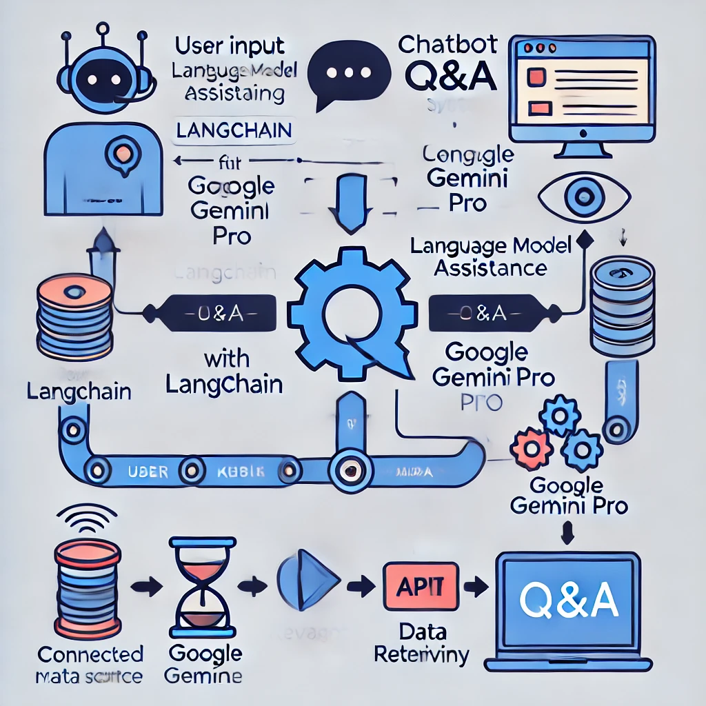

# Chatbot Q&A - Generative AI Application
## Built Using Google Gemini, Langchain, Python, Docker, Streamlit
## Models used:
    gemini-1.5-flash

## Introduction
We will build a Chatbot Question and Answer Application using Docker, Python, Langchain, and Streamlit.

In this hands-on tutorial, we will demonstrate the following:
- Architecture of the applications
- Build 1 applications and create DOCKER images

## Architecture

### Docker Commands:

  Build Docker Image:
  `docker build -t invoice-extractor .`

  Run ADMIN application:
  `docker run -p 8083:8083 -it invoice-extractor`

## Build Chatbot Application:
- Set up the environment
- Initialize the API
- Create chat handling function
- Build user interface with Streamlit
- Manage context and chat history
- Using Prompt template, provide the question and context to the Large Language Model.
-  Display the LLM's response to the user.

### Docker Commands:

  Build Docker Image:
  `docker build -t invoice-extractor .`

  Run ADMIN application:
  `docker run -p 8084:8084 -it invoice-extractor`

#### Note: The docker volume mount is only needed in local. If you are running the container in ECS, or EKS, the iam role is used.
