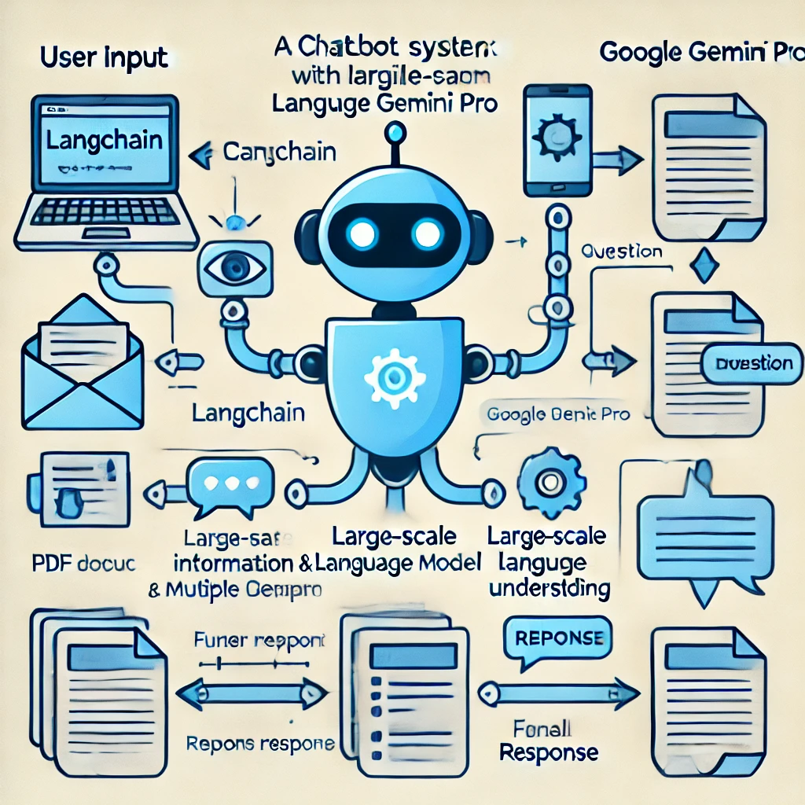

# Chat with PDF - Generative AI Application
## Built Using Google Gemini, Langchain, Python, Docker, Streamlit
## Models used:
    embedding-001
    gemini-1.5-flash

## Introduction
We will build a Chatbot-like application using Docker, Python, Langchain, and Streamlit. We will leverage the concept of Retrieval-Augmented Generation (RAG) to provide context to the Large Language Model along with the user's query, generating responses from our knowledge base.

In this hands-on tutorial, we will demonstrate the following:
- Architecture of the applications
- Build 1 applications and create DOCKER images

## Architecture

## ADMIN Application:
  - Build Admin Web application where AdminUser can upload the pdf.
  - The PDF text is split into chunks
  - Using the Embedding Model of Google embedding-001, create the vector representation of the chunks
  - Using FAISS, save the vector index locally

### Docker Commands:

  Build Docker Image:
  `docker build -t pdf-reader-admin .`

  Run ADMIN application:
  `docker run -p 8083:8083 -it pdf-reader-admin`

## USER Application:
  - Build User Web application where users can query / chat with the pdf.
  - At the application start, local FAISS index (vector store)
  - Langchain's RetrievalQA, does the following:
    - Convert the User's query to vector embedding using Google Generative AI Embeddings Model (Make sure to use the same model that was used for creating the chunk's embedding on the Admin side)
    - Do similarity search to the FAISS index and retrieve 5 relevant documents pertaining to the user query to build the context
    - Using Prompt template, provide the question and context to the Large Language Model.
   -  Display the LLM's response to the user.

### Docker Commands:

  Build Docker Image:
  `docker build -t pdf-reader-client .`

  Run ADMIN application:
  `docker run -p 8084:8084 -it pdf-reader-client`

#### Note: The docker volume mount is only needed in local. If you are running the container in ECS, or EKS, the iam role is used.
